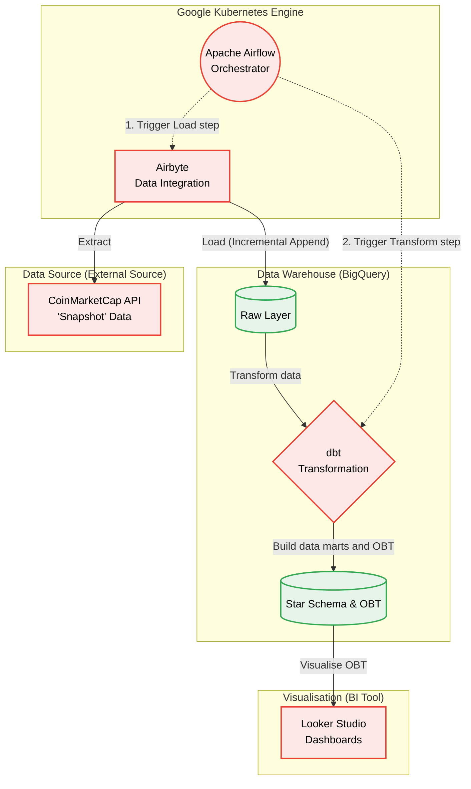

# Crypto Market ELT Pipeline

## Project Overview
This project is an automated, end-to-end ELT (Extract, Load, Transform) data pipeline designed to track real-time cryptocurrency market data. It extracts data from the CoinMarketCap API, loads it into a cloud data warehouse, and transforms it into highly optimized data models for business intelligence and analytics.

**Key Achievements:**
- Converted a "Snapshot-only" API into a robust **Time-Series database** using scheduled incremental loads.
- Designed a **Star Schema** and a **One Big Table (OBT)** to optimize downstream dashboard performance.
- Containerized and orchestrated the entire workflow on **Kubernetes (GKE)** for high availability.

---

## System Architecture


**Data Flow:**
1. **Extract & Load:** **Airbyte** (deployed on GKE) extracts cryptocurrency listings and categories from CoinMarketCap API and loads the raw JSON data into **Google BigQuery**.
2. **Transform:** **dbt (Data Build Tool)** cleans, normalizes, and models the raw data into Staging, Dimensions, Facts, and ultimately an OBT.
3. **Orchestrate:** **Apache Airflow** schedules the pipeline to run hourly, managing dependencies and retries.
4. **Visualize:** **Looker Studio** connects directly to the OBT to render interactive dashboards.

---

## Tech Stack
- **Cloud Infrastructure:** Google Cloud Platform (GCP), Google Kubernetes Engine (GKE)
- **Data Orchestration:** Apache Airflow, Docker
- **Data Ingestion:** Airbyte (Custom API connectors)
- **Data Warehouse:** Google BigQuery
- **Data Transformation:** dbt (Data Build Tool), SQL
- **BI & Analytics:** Looker Studio

---

## Data Modeling
The data warehouse is structured using a hybrid approach of **Star Schema** for analytical flexibility and **One Big Table (OBT)** for BI tool optimization.

- **`dim_coin`**: Dimension table storing static attributes of cryptocurrencies (ID, Name, Symbol, Max Supply).
- **`brg_coin_tags`**: Bridge table managing the many-to-many relationship between coins and their ecosystems (e.g., DeFi, Layer-1, AI).
- **`marts_hourly_crypto`**: Fact table storing hourly partitioned time-series data (Price, Volume, Market Cap).
- **`obt_crypto_ecosystem`**: The final denormalized table combining all dimensions and facts, highly clustered and partitioned for Looker Studio ingestion.


---

## 🖥️ Accessing the Services (Local Port Forwarding)
Since the infrastructure is deployed on Google Kubernetes Engine (GKE), you can access the UI of Airflow and Airbyte locally using `kubectl port-forward`.

**1. Access Apache Airflow UI:**
```bash
# Forward Airflow service to local port 8081
kubectl port-forward svc/my-airflow-api-server 8081:8080 --namespace airflow

# Open your browser and visit: http://localhost:8081

# Forward Airbyte deployment to local port 8080
kubectl -n airbyte port-forward deployment/airbyte-server 8080:8001

# Open your browser and visit: http://localhost:8080
```

---

## Key Challenges & Solutions

### 1. Overcoming the "Snapshot API" Limitation
**Challenge:** The CoinMarketCap free API tier only provides current market data (`/latest`), with no access to historical time-series data. 
**Solution:** I utilized Airflow to schedule pipeline runs strictly every hour. In Airbyte, I configured the sync mode for the `listings` stream to **Incremental | Append**. This strategy effectively builds a custom historical time-series database from scratch, enabling the tracking of price volatility and volume over time.

### 2. Handling Missing Ecosystem Data
**Challenge:** Not all cryptocurrencies belong to an ecosystem tag, which could cause data loss during table joins.
**Solution:** Implemented robust `LEFT JOIN` logic in dbt when building the OBT, ensuring that coins without specific tags are still retained in the overall market cap and tracking metrics.
